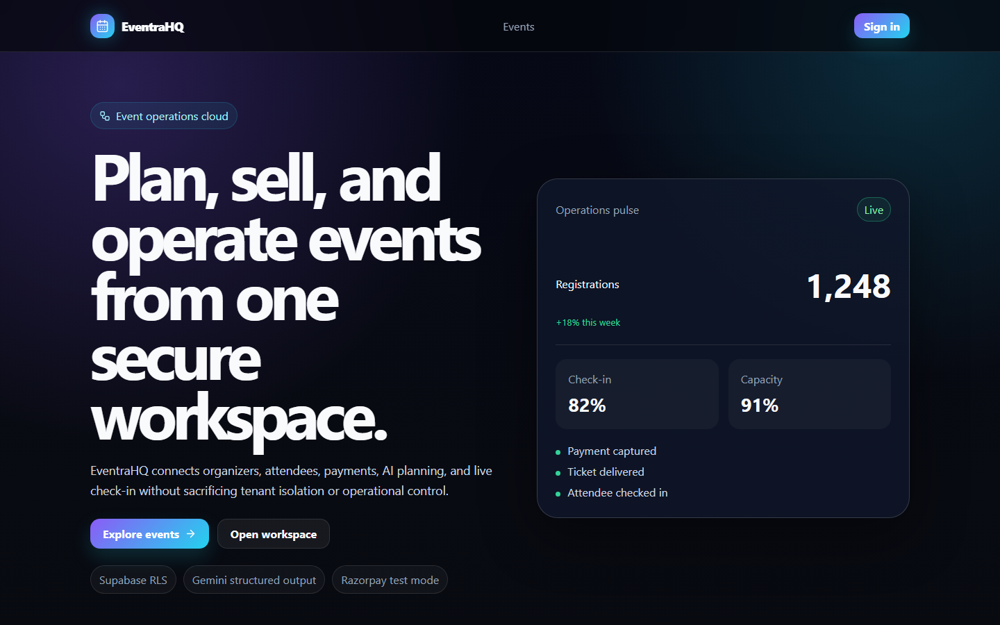
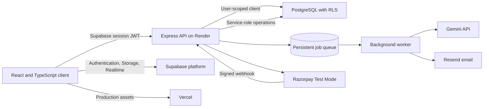
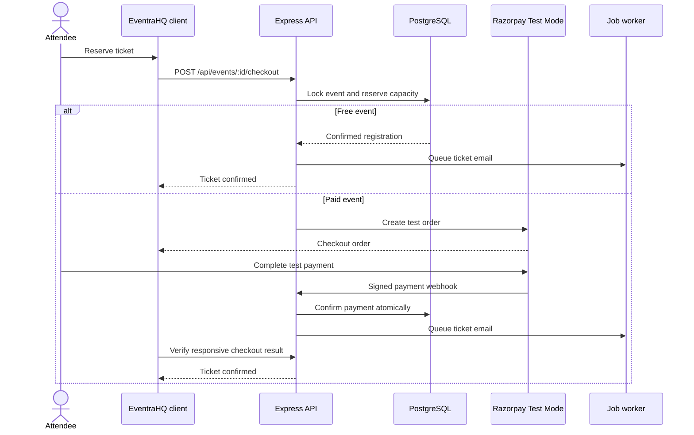
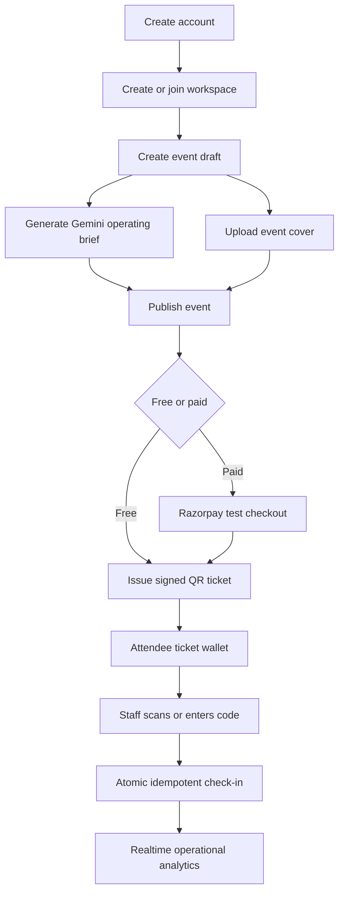
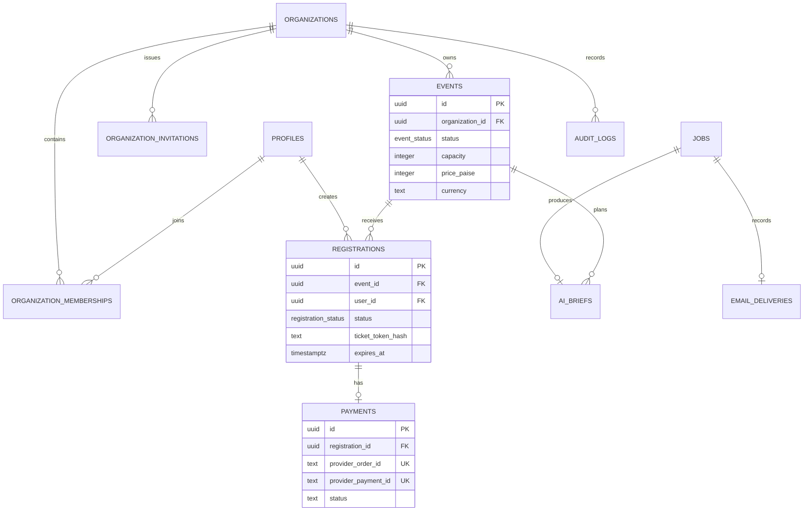
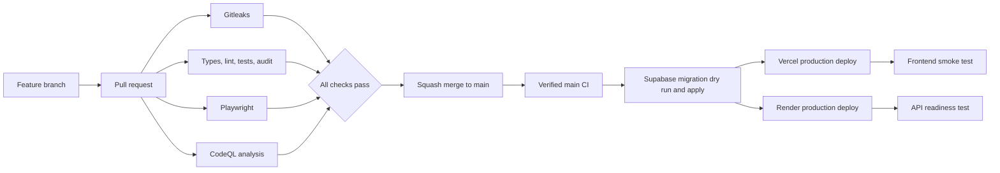

# EventraHQ

[](https://github.com/Tanishk-rathore-01/eventrahq-fullstack-saas/actions/workflows/ci.yml)
[](https://github.com/Tanishk-rathore-01/eventrahq-fullstack-saas/actions/workflows/codeql.yml)

EventraHQ is a production-oriented, multi-tenant event operations platform. It gives organizers one secure workspace for event publishing, AI-assisted planning, registrations, test payments, ticket delivery, attendee operations, and verified QR check-in.



## 1. About the project

### A. Topic

EventraHQ demonstrates full-stack SaaS engineering for the event-management domain, with particular focus on tenant isolation, payment correctness, asynchronous integrations, operational security, and reliable deployment.

### B. Problem

Event teams commonly coordinate planning, sales, guest lists, payments, emails, and on-site check-in through separate tools. That fragmentation produces inconsistent attendee data, duplicated work, weak access control, and difficult incident recovery.

### C. Solution

EventraHQ combines these workflows while preserving clear security boundaries:

- Organizations own workspaces and data.
- Owners, managers, and check-in staff receive distinct permissions.
- Database row-level security protects organization records.
- Seat reservations and payment confirmations use row locks to prevent overselling.
- Slow or unreliable provider operations run through a persistent retryable queue.
- Audit records preserve operational history.

### D. Intended audience

- Event organizers managing free and paid events.
- Operations teams coordinating attendees and check-in staff.
- Attendees discovering events and managing tickets.
- Engineering reviewers evaluating production-focused TypeScript, PostgreSQL, security, and cloud-delivery practices.

## 2. Product capabilities

| Area | Capability |
| --- | --- |
| Identity | Supabase email/password authentication, verification, recovery, and refreshable sessions |
| Workspaces | Multi-tenant organizations, expiring invitations, and owner, manager, or check-in roles |
| Events | Search, filtering, drafts, publishing, lifecycle control, cover uploads, capacity, and INR pricing |
| AI planning | Gemini structured briefs with persisted jobs, quotas, retries, prompt versioning, and output validation |
| Registration | Atomic 15-minute seat holds, free registration, and concurrency-safe capacity checks |
| Payments | Razorpay Test Mode orders, signature verification, retry-safe webhooks, and idempotent confirmation |
| Communication | Resend invitation, ticket, cancellation, and payment-failure delivery jobs with delivery records |
| Ticketing | Signed QR tickets, wallet display, camera scanning, manual fallback, and idempotent check-in |
| Operations | Attendee lists, live registration updates, organization analytics, audit logs, and structured logging |
| Administration | Platform-level analytics isolated from organization roles |

## 3. System architecture



The browser receives only public Supabase and API configuration. Supabase service-role credentials, Gemini, Resend, Razorpay, webhook, database, and ticket-signing secrets remain in server-side secret stores.

## 4. Registration and payment workflow



Duplicate webhook events return an idempotent success only after the original event was processed. Failed events remain retryable, while expired paid holds cannot be converted into confirmed seats.

## 5. User workflow



## 6. Core data model



## 7. Technology stack

| Layer | Technologies |
| --- | --- |
| Frontend | React 19, Vite 8, strict TypeScript, React Router, Lucide, Recharts |
| Backend | Express 5, strict TypeScript, Zod, Pino, Helmet, rate limiting |
| Data platform | Supabase Auth, PostgreSQL, RLS, Storage, Realtime |
| AI | `@google/genai` with Gemini 3.5 Flash structured output |
| Commerce | Razorpay Test Mode with server-side order creation and signed webhooks |
| Email | Resend with persistent delivery jobs and provider idempotency keys |
| Quality | Vitest, Supertest, Playwright, ESLint, CodeQL, Gitleaks |
| Delivery | npm workspaces, Docker, GitHub Actions, Vercel, Render, Supabase CLI |

## 8. Repository structure

```text
backend/                 Express API, worker, tests, and Supabase migrations
frontend/                React application and browser acceptance tests
packages/contracts/      Shared Zod schemas and TypeScript contracts
scripts/                 Repository validation utilities
docs/                    Architecture, quality, résumé, and image assets
.github/workflows/       CI, CodeQL, and production CD workflows
render.yaml              Render Blueprint configuration
vercel.json              Vercel build, routing, and security headers
```

## 9. Local installation

### A. Requirements

- Node.js 22 or newer.
- npm 11 or newer.
- A Supabase project.
- Gemini, Resend, and Razorpay Test Mode credentials for provider features.

### B. Setup

1. Clone the repository.
2. Install the exact dependency graph with `npm ci`.
3. Copy `backend/.env.example` to `backend/.env`.
4. Copy `frontend/.env.example` to `frontend/.env`.
5. Apply every file in `backend/supabase/migrations` in filename order.
6. Add `http://localhost:5173/dashboard` and `http://localhost:5173/auth/reset` to Supabase Auth redirect URLs.
7. Start both workspaces with `npm run dev`.

Local addresses:

- Frontend: `http://localhost:5173`
- API liveness: `http://localhost:5050/api/health/live`
- API readiness: `http://localhost:5050/api/health/ready`

### C. Environment boundaries

| Location | Public values | Private values |
| --- | --- | --- |
| Frontend | API URL, Supabase URL, Supabase publishable key | None |
| Backend | Application URL, allowed origins, model name | Service-role key, provider secrets, webhook secret, ticket secret |
| GitHub | Smoke-test URLs | Deployment tokens, database password, Render deploy hook |

Never place service-role credentials or provider secrets in `VITE_*` variables.

### D. Demo seed

Provide a unique password through the process environment and run the idempotent seed:

```powershell
$env:DEMO_PASSWORD='choose-a-unique-12-plus-character-password'
npm run seed
```

The seed creates platform-admin, organizer, check-in staff, attendee, free-event, and paid-event scenarios. The password is not stored in source control.

## 10. API surface

| Area | Contract |
| --- | --- |
| Identity | `GET /api/me` |
| Organizations | `GET/POST /api/organizations`, member, role, invitation, and acceptance routes |
| Events | `GET/POST/PATCH /api/events`, organizer event lists, attendees, and signed uploads |
| AI | `POST /api/ai/event-brief`, `GET /api/ai/jobs/:id` |
| Checkout | `POST /api/events/:id/checkout`, `POST /api/payments/verify` |
| Webhooks | `POST /api/webhooks/razorpay` with untouched raw-body verification |
| Tickets | `GET /api/tickets`, `POST /api/tickets/check-ins` |
| Analytics | Organization-scoped analytics and platform-admin analytics |
| Health | `GET /api/health/live`, `GET /api/health/ready` |

Shared Zod contracts validate request and response shapes across frontend and backend workspaces.

## 11. Security model

- Supabase validates and refreshes user sessions.
- User-scoped database clients allow PostgreSQL RLS to enforce tenant boundaries.
- The service-role client is limited to worker, payment, administrative, and migration operations.
- Database functions lock capacity and registration rows during reservation, payment, and check-in.
- QR values are signed, and only token hashes are stored.
- Razorpay signatures use timing-safe comparison and raw webhook bodies.
- Webhook records are deduplicated and remain retryable until processing succeeds.
- Email HTML is escaped, action URLs are restricted to HTTP or HTTPS, and provider calls use idempotency keys.
- Request IDs, structured logs, strict CORS, CSP, rate limits, and sanitized errors reduce operational risk.
- CI performs secret scanning, dependency auditing, static analysis, tests, and production builds.

## 12. Verification

```bash
npm run migrations:check
npm run typecheck
npm run lint
npm test
npm run build
npm run test:e2e
npm run audit:ci
```

Database concurrency and live-provider smoke tests require configured development credentials and must run before production deployment.

## 13. CI/CD workflow



The deployment workflow checks out the exact verified commit, applies database migrations before application rollout, prevents overlapping production runs, and stops when readiness checks fail.

## 14. Deployment configuration

### A. Vercel

- Import the repository root.
- Configure `VITE_API_URL`, `VITE_SUPABASE_URL`, and `VITE_SUPABASE_PUBLISHABLE_KEY`.
- Keep the generated production URL stable for Supabase redirects and backend CORS.

### B. Render

- Create the service from `render.yaml`.
- Configure the server-side variables documented in `backend/.env.example`.
- Register the generated deploy hook as the GitHub `RENDER_DEPLOY_HOOK_URL` secret.

### C. Supabase

- Apply ordered migrations before the API deployment.
- Configure development and production Auth redirect URLs.
- Keep the service-role key only in backend and deployment secret stores.

### D. Razorpay and Resend

- Register `https://<render-api>/api/webhooks/razorpay` as a Razorpay Test Mode webhook.
- Use the sandbox Resend sender only for permitted test recipients, or verify a domain before broader delivery.

## 15. Free-tier limitations

- Razorpay is intentionally restricted to Test Mode; no real settlement or organizer payout flow is present.
- Render free services may sleep and require a cold start before the API becomes ready.
- Supabase, Gemini, Resend, Render, and Vercel quotas are controlled by their providers and can change.
- Resend sandbox delivery is restricted until a sending domain is verified.
- Production migrations and live-provider smoke tests require credentials created in the project owner's accounts.

## 16. Engineering résumé statement

Built a multi-tenant event operations SaaS with React, TypeScript, Express, Supabase PostgreSQL/Auth/RLS/Storage/Realtime, Gemini, Razorpay, and Resend; implemented concurrency-safe ticket inventory, retryable asynchronous jobs, signed payment webhooks, QR check-in, security automation, and gated cloud deployment through GitHub Actions.

Additional résumé variants are available in `docs/ATS_RESUME_BULLETS.md`.
